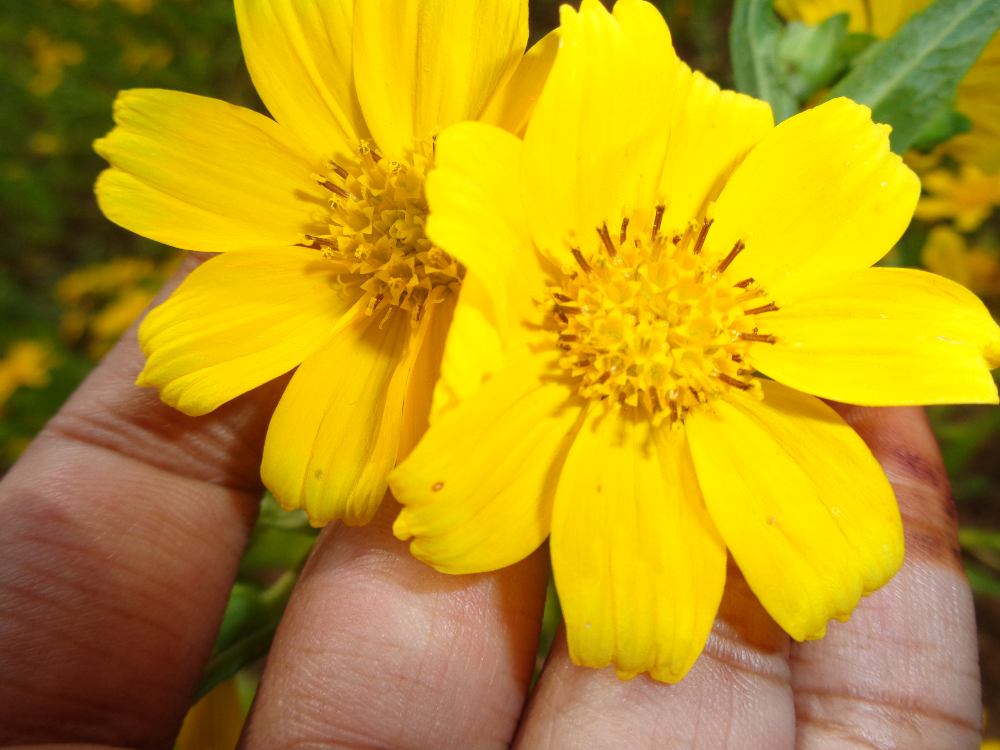
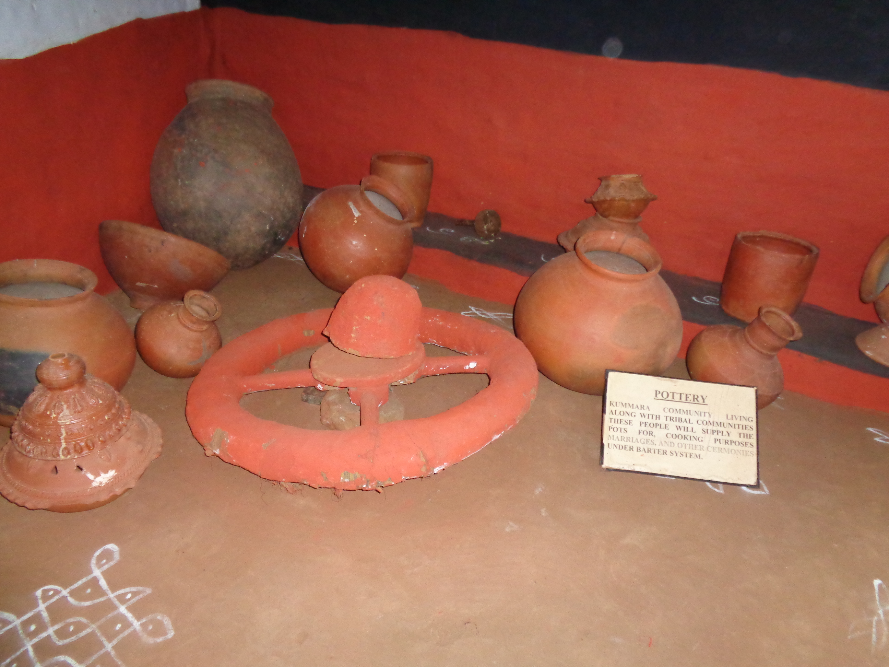
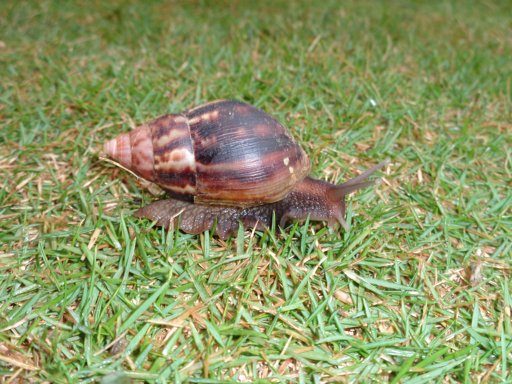

# Welcome to my website!
my aassignment 

love for nature and earth

a flower is a reproductive structure found in flowering plants. 

pottry is commonly made in villages .They use pots instead of utensils

a snail is a shelled gastropod that have a coiled shell.